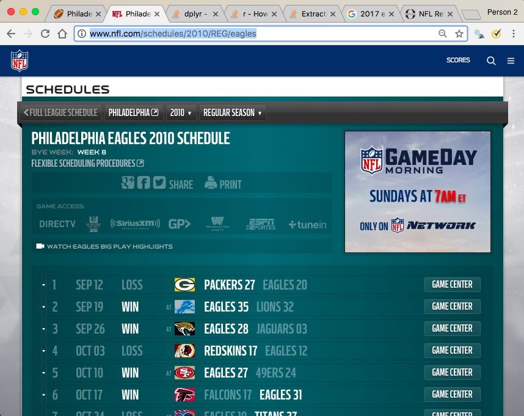

```{r setup, include=FALSE}
knitr::opts_chunk$set(echo = TRUE)
#rm(df_1, df_2, spl, spl.1, x, y, z, game_data, game_data_1, game_data_2, Test, tables, webpage)

# install.packages("dplyr")
# install.packages("tidyr")
# install.packages("rvest")
# install.packages("xml2")
# install.packages("stringi")
# install.packages("doParallel")
# 
#
# packrat::status()
# packrat::snapshot()
# packrat::restore()
```

## The Goal of this Project

On October 12, 2017, the Eagles played the Panthers in South Carolina and won 28 to 23. This was a close game considering points scored. Regarding penalties acquired and loss of yards there was no such contest. The Eagles received 10 penalty calls for a loss of 126 yards, yet the Panthers were only flagged once during an Eagles point after; where Pederson elected to go for 2 and apply the penalty moving the ball 1 yard closer to the goal line. Thus, Eagles > 10 penalties >> for a loss of 126 yards lost, whereas the Panthers > 1 penalty >> - 1 yard. 

Philadelphia fans -- with considerable frustration -- signed a petition (created by Will Philbrick) that received (the last I saw) over 70k signatures stating that referee Pete Morelli and his crew have a bias against the Eagles stating that “Over the last four games that (Morelli) has officiated that the Eagles were playing in, the Eagles were flagged a total of 40 times for 396 yards, while the Eagles opponent in those games were flagged a mere 8 times for 74 yards." Furthermore, this petition requested that Morelli's crew not be allowed to officiate any more Eagle games (1). This -- as one might imagine -- received a direct address from NFL Referees Association which stated “Claims like these demonstrate a fundamental lack of knowledge about NFL officiating,” and that "“NFL officials are graded on every call made in every game. Missing a single one can hurt his or her ranking and may be the difference between working in the postseason or not." This is information that many NFL fans might very well not be aware of; however, this argument does not address the concerns of those who signed the petition, which is that a bias exists. Whether or not bias does exist is perceivable unknown at this time; still, if it does exist it would not in the form of "bad calls", but as "no calls". Therefore, finding if bias exists in the form of "no calls" is the focus of this research.


##Methodology
###Part A: Data Collection

**This is the list of all the data sets collected/scraped and used for this research:**

+ Penalty call type per game
    + This data shows what call happened at what time for every regular season game from 2010 - 2017

**These are the data sets created in order to then create the data sets used for the research:**

+ List of urls for the NFL website that shows game [date] and [team] information
+ another one…


###Scraping the data

The data collected here is **penalty data by type and time per game for all teams from 2010-2017.** Below is an example of one of the many urls to the website that data is collected from. The readon there are **many** websites is because each game has its own unique website. Please see below >>

[http://www.nflpenalties.com/game/philadelphia-eagles-at-carolina-panthers-10-12-2017](http://www.nflpenalties.com/game/philadelphia-eagles-at-carolina-panthers-10-12-2017)

The "http://www.nflpenalties.com/game/" part of the url is constant for every game's url; however, it also requires game data that I currently **do not have.** For example - and to use the above url some more - in order to complete this url I need to know who played who (e.g. "philadelphia-eagles-at-carolina"), where (e.g. "at"), and when (e.g "10-12-2017"). **Before I can create these urls I need to get this game data for every game from 2010 to 2017.**

To get this game data I found this website that seems pretty easy to scrape >>
[http://www.nfl.com/schedules/2010/REG/eagles](http://www.nfl.com/schedules/2010/REG/eagles)

…that looks like this >>

 ***
 
 Before getting too ahead of ourselves, let's load the packages.
```{r message=FALSE, warning=FALSE}
library(dplyr)
library(tidyr)
library(rvest)
library(xml2)
library(stringi)
```

The url is simple -- in that all I need are all the team names as well as the years that I'm interested in. With that, I make a list of url addresses that I'll use to scrape the data with…
```{r}
# I need the years
just_years <- data.frame(2010:2017, stringsAsFactors = F)

# Then the teams…and since I'll ultimately will need the team locals I'll create a data set with both
just_teams <- data.frame(team_names = c("eagles", "redskins", "giants", "cowboys", "patriots"
                , "steelers", "chiefs", "raiders", "texans", "dolphins"
                , "ravens", "browns" , "buccaneers", "bengals", "49ers" , "seahawks"
                , "rams", "chargers", "lions", "bills", "jets", "panthers", "jaguars"
                , "vikings", "packers", "saints", "falcons", "cardinals", "bears"
                , "titans", "colts", "broncos")
                , team_locals = c("philadelphia", "washington", "new-york", "dallas"
                                  , "new-england", "pittsburgh", "kansas-city", "oakland"
                                  , "houston", "miami", "baltimore", "cleveland"
                                  ,  "tampa-bay", "cincinnati", "san-francisco", "seattle"
                                  , "los-angeles", "los-angeles", "detroit", "buffalo"
                                  , "new-york", "carolina", "jacksonville", "minnesota"
                                  , "green-bay", "new-orleans", "atlanta", "arizona"
                                  , "chicago", "tennessee", "indianapolis", "denver")
                , stringsAsFactors = F)

just_teams <- just_teams %>% mutate(TEAM_NAMES = stri_trans_general(team_names, id = "Title"))
just_teams$TEAM_NAMES[just_teams$TEAM_NAMES == "49Ers"] <- "49ers"

# I'll also need info regarding the months too, so…
just_months <- data.frame(month_abrv = c("Sep", "Oct", "Nov", "Dec", "Jan")
                          , month_num = c("09", "10", "11", "12", "01")
                          , stringsAsFactors = F)
```

Now I have everything needed to create the url addresses with let's create the list of urls we'll need for the loop.

```{r}
i <- 1
j <- 1

x <- paste0("http://www.nfl.com/schedules/",just_years[i,1],"/REG/",just_teams[j,1]) %>% 
        data.frame(stringsAsFactors = F) 

x$year <- just_years[i,1]
x$team <- just_teams[j,1]
urls <- x

for (i in 1:8) {
  for (j in 1:32) {
    
x <- paste0("http://www.nfl.com/schedules/",just_years[i,1],"/REG/",just_teams[j,1]) %>% 
  data.frame(stringsAsFactors = F)
x$year <- just_years[i,1]  
x$team <- just_teams[j,1]
urls <- bind_rows(urls,x) %>% distinct()
  }
} # makes >> "urls"

rm(x)
```

Now we have all the url addresses we need in the object appropriately named "urls", so let's start scraping the data from the website shown above. Specifically, I want to first take the **date** data and do so with the following code…also, I'm going to use `urls[1,1]` which is the same Eagles url we've used thus far.
```{r}
webpage <- read_html(urls[1,1])

data_html <- html_nodes(webpage,'.list-matchup-row-date')
game_date_data <- html_text(data_html)
game_date_data <- data.frame(game_date_data, stringsAsFactors = F)
game_date_data <- game_date_data %>% filter(game_date_data != "Bye Week")
game_date_data
```

Now I want the **game** data (i.e. teams played and where) and do so with the following code.

```{r}
data_html <- html_nodes(webpage,'.at , .win , .lost')
game_game_data <- html_text(data_html)
game_game_data <- data.frame(game_game_data, stringsAsFactors = F)
head(game_game_data, n = 13)
```

The data was scraped easy enough, but from the looks of the output -- above -- some data wrangling is definitely needed. For instance, the "\r\n\t\t\t\t\r\n\t\t\t" isn't needed, yet it does show the start and end of each game's data set. Following this is either an "at" or a "". This "at" means that the game took place at the home of the first team listed (e.g. above: no "at" for the first set means the game was at the Eagles home, whereas the following has an "at" so the set states the game was played at Detroit). The scores are posted after this and then again next to/with the team names. Now, because I am trying to collect data regarding which team played who, where, and when the scores aren't actually of interest to me at this time. Still, you never know what you might need later and score data is intrinsically important, so I'll keep it for now. 

```{r}
game_game_data$id <- 1:6
game_game_data$id <- as.character(game_game_data$id)
names(game_game_data)[1] <- "data"

i <- 1
x <- game_game_data %>% filter(id == i) %>% select(1)
new_data <- x

for (i in 2:6) {
  
  x <- game_game_data %>% filter(id == i) %>% select(1)
  new_data <- bind_cols(new_data,x)
  
}
```

Lucky enough, every team in column `data5` are the home teams, so I name this column `home_team` and the one before it `away_team`. Also, because I said I would keep the score data for now, I'll name these score columns `home_score` and `away_score1` respectively. Lastly, I'll tidy the data up a little too, so I get something nice, neat, and durable enough for some wrangling I still have left to do. 

```{r}
names(new_data)[3] <- c("away_score")
names(new_data)[4] <- c("home_score")
new_data$away_team = substr(new_data$data4,1,nchar(new_data$data4)-3)
new_data$home_team = substr(new_data$data5,1,nchar(new_data$data5)-3)

new_data <- bind_cols(new_data,game_date_data)

new_data$game_month <- substr(new_data$game_date_data, 1
                             , nchar(new_data$game_date_data)-2)
new_data$game_day <- substr(new_data$game_date_data, 4
                              , nchar(new_data$game_date_data)+2)

new_data$year <- urls[1,2]
new_data$team <- urls[1,3]

new_data <- left_join(new_data, just_months, by = c("game_month" = "month_abrv"))
new_data$game_date <- paste(new_data$month_num, new_data$game_day, sep = "-")
new_data$game_date <- paste(new_data$game_date, new_data$year, sep = "-")
 
new_data <- new_data %>% select(-c(1,2,5,6,game_date_data,game_day,game_month,month_num))

head(new_data)
```

Okay! We're just about where we need to be. We have the *who, where, and when*. However, the 2017 season is still currently underway, so it can't be scraped under the same protocol as above. As such, the above loop is used for 2010-2016 and another -- slightly different loop -- will be made below. Furthermore, let's make seperate feeder df objects for each loop now…
```{r}
urls$num <- 1:256

urls_2010_16 <- urls %>% filter(year < 2017)
urls_2017_18 <- urls %>% filter(year >= 2017)
```

I don't necessarily need to use these separate dfs because I could just use `urls` up to row number 224 and another from 225 to 256; however, to keep things separate so I can make adjustments to the current season without affecting the the past seasons, so I chose to make separate dfs.

This whole set of code (above) will now be used in a loop that replicates all the steps made with, so let's make / run this loop and in turn build our data.

**Note: An issue was discovered in some of the websites in that a space was missing bringing what is supposed to be 6 spaces to 5. As such, these websites (notated out in the below loop) were removed from the "urls_2010_16" df and placed in another df named "urls_2010_16_needing_repairs" (below) by their number with the non-problematic urls being placed in the object named "urls_2010_16_no_repairs". These problematic urls are then addressed in the code following the loop individually: because this spacing error is unique to the website (i.e. the error location changes every time a new website is read in).**

```{r}
urls_2010_16_no_repairs <- urls_2010_16 %>% filter(num != 79 &
                                                   num != 81 &
                                                   num != 120 &
                                                   num != 121 &
                                                   num != 142 &
                                                   num != 150 &
                                                   num != 194 &
                                                   num != 206 &
                                                   num != 208 &
                                                   num != 220 )

urls_2010_16_needing_repairs <- anti_join(urls_2010_16,urls_2010_16_no_repairs)
```
***

###Now it's time for the loop…

First, let's make our base data set to build on…
```{r eval=FALSE}
new_data_build <- new_data
```

…and then scrape the data. 

```{r eval=FALSE}
for (i in 1:214) {
  # i <- 79
  # i <- 81
  # i <- 120
  # i <- 121
  # i <- 142
  # i <- 150
  # i <- 194
  # i <- 206
  # i <- 208
  # i <- 220  <<< these are the problematic urls
  
webpage <- read_html(urls_2010_16_no_repairs[i,1])

data_html <- html_nodes(webpage,'.list-matchup-row-date')
game_date_data <- html_text(data_html)
game_date_data <- data.frame(game_date_data, stringsAsFactors = F)
game_date_data <- game_date_data %>% filter(game_date_data != "Bye Week") %>% distinct()

data_html <- html_nodes(webpage,'.at , .win , .lost')
game_game_data <- html_text(data_html)
game_game_data <- data.frame(game_game_data, stringsAsFactors = F)

try(game_game_data$id <- 1:6)
game_game_data$id <- as.character(game_game_data$id)
names(game_game_data)[1] <- "data"

j <- 1
x <- game_game_data %>% filter(id == j) %>% select(1)
new_data <- x

for (j in 2:6) {
  
  x <- game_game_data %>% filter(id == j) %>% select(1)
  new_data <- bind_cols(new_data,x)
  
}

names(new_data)[3] <- c("away_score")
names(new_data)[4] <- c("home_score")
new_data$away_team = substr(new_data$data4,1,nchar(new_data$data4)-3)
new_data$home_team = substr(new_data$data5,1,nchar(new_data$data5)-3)

new_data <- bind_cols(new_data,game_date_data)

new_data$game_month <- substr(new_data$game_date_data, 1
                             , nchar(new_data$game_date_data)-2)
new_data$game_day <- substr(new_data$game_date_data, 4
                              , nchar(new_data$game_date_data)+2)

new_data$year <- urls_2010_16_no_repairs[i,2]
new_data$team <- urls_2010_16_no_repairs[i,3]

new_data <- left_join(new_data, just_months, by = c("game_month" = "month_abrv"))
new_data$game_date <- paste(new_data$month_num, new_data$game_day, sep = "-")
new_data$game_date <- paste(new_data$game_date, new_data$year, sep = "-")
 
new_data <- new_data %>% select(-c(1,2,5,6,game_date_data,game_day,game_month,month_num))

new_data_build <- bind_rows(new_data_build, new_data)
print(i)
}

```

Now this isn't ideal and will likely be temporary until I find a better solution; however, and until then, those problematic urls listed above are corrected by hand below. As such, the below code is going to look a little like scratch work for the time being until I figure out a bettr solution to the problem -- this note was included on 11/19/17. 
```{r eval=FALSE}

# total of 10 rows from urls_2010_16_needing_repairs

i <- 10
{
webpage <- read_html(urls_2010_16_needing_repairs[i,1])

data_html <- html_nodes(webpage,'.list-matchup-row-date')
game_date_data <- html_text(data_html)
game_date_data <- data.frame(game_date_data, stringsAsFactors = F)
game_date_data <- game_date_data %>% filter(game_date_data != "Bye Week") %>% distinct()

data_html <- html_nodes(webpage,'.at , .win , .lost')
game_game_data <- html_text(data_html)
game_game_data <- data.frame(game_game_data, stringsAsFactors = F)
}
### repair work == adding the missing space where needed
game_data_1 <- game_game_data %>% slice(1:36)

game_data_2 <- game_game_data %>% slice(37:95)

y <- data.frame(game_game_data = "", stringsAsFactors = F)

game_game_data <- bind_rows(game_data_1, y, game_data_2)
###
{
try(game_game_data$id <- 1:6)
game_game_data$id <- as.character(game_game_data$id)
names(game_game_data)[1] <- "data"

j <- 1
z <- game_game_data %>% filter(id == j) %>% select(1)
new_data <- z

for (j in 2:6) {
  
  z <- game_game_data %>% filter(id == j) %>% select(1)
  new_data <- bind_cols(new_data,z)
  
}

names(new_data)[3] <- c("away_score")
names(new_data)[4] <- c("home_score")
new_data$away_team = substr(new_data$data4,1,nchar(new_data$data4)-3)
new_data$home_team = substr(new_data$data5,1,nchar(new_data$data5)-3)

new_data <- bind_cols(new_data,game_date_data)

new_data$game_month <- substr(new_data$game_date_data, 1
                             , nchar(new_data$game_date_data)-2)
new_data$game_day <- substr(new_data$game_date_data, 4
                              , nchar(new_data$game_date_data)+2)

new_data$year <- urls_2010_16_needing_repairs[i,2]
new_data$team <- urls_2010_16_needing_repairs[i,3]

new_data <- left_join(new_data, just_months, by = c("game_month" = "month_abrv"))
new_data$game_date <- paste(new_data$month_num, new_data$game_day, sep = "-")
new_data$game_date <- paste(new_data$game_date, new_data$year, sep = "-")
 
new_data <- new_data %>% select(-c(1,2,5,6,game_date_data,game_day,game_month,month_num))

new_data_build <- bind_rows(new_data_build, new_data)
print(i)
}


```

Now to scrape the data for this season, which is nearly the same loop -- just with a few adjustments to data after it's scraped and before it's wrangled. 

To get all the teams data run this after Monday Night Football. Likely, around Tuesday evening might work sufficiently. 

```{r eval=FALSE}
week_num_2_start <- 2 # This should change to 9 when adding in week 10 and so forth. 
week_number <- 9
for (i in 1:32) {

  # urls_2017_18[32,1]
  # i <- 1
webpage <- read_html(urls_2017_18[i,1])

data_html <- html_nodes(webpage,'.list-matchup-row-date')
game_date_data <- html_text(data_html)
game_date_data <- data.frame(game_date_data, stringsAsFactors = F)
game_date_data <- game_date_data %>% filter(game_date_data != "Bye Week") %>% distinct()

data_html <- html_nodes(webpage,'.at , .win , .lost')
game_game_data <- html_text(data_html)
game_game_data <- data.frame(game_game_data, stringsAsFactors = F)
game_game_data <- game_game_data %>% slice(2:49)

try(game_game_data$id <- 1:6)
game_game_data$id <- as.character(game_game_data$id)
names(game_game_data)[1] <- "data"

j <- 1
x <- game_game_data %>% filter(id == j) %>% select(1)
new_data <- x

for (j in 2:6) {
  
  x <- game_game_data %>% filter(id == j) %>% select(1)
  new_data <- bind_cols(new_data,x)
  
}

names(new_data)[3] <- c("away_score")
names(new_data)[4] <- c("home_score")
new_data$away_team = substr(new_data$data4,1,nchar(new_data$data4)-3)
new_data$home_team = substr(new_data$data5,1,nchar(new_data$data5)-3)

game_date_data <- game_date_data %>% slice(week_num_2_start:week_number)
new_data <- bind_cols(new_data,game_date_data)

new_data$game_month <- substr(new_data$game_date_data, 1
                             , nchar(new_data$game_date_data)-2)
new_data$game_day <- substr(new_data$game_date_data, 4
                              , nchar(new_data$game_date_data)+2)

new_data$year <- urls_2017_18[i,2]
new_data$team <- urls_2017_18[i,3]

new_data <- left_join(new_data, just_months, by = c("game_month" = "month_abrv"))
new_data$game_date <- paste(new_data$month_num, new_data$game_day, sep = "-")
new_data$game_date <- paste(new_data$game_date, new_data$year, sep = "-")
 
new_data <- new_data %>% select(-c(1,2,5,6,game_date_data,game_day,game_month,month_num))

new_data_build <- bind_rows(new_data_build, new_data)
print(i)
}


new_data_build -> who_where_when_df
rm(new_data_build)
```

***
Now, because I ran the above script separate from the RMarkdown -- and I want to use the df that the loop made for the following scripts -- I'm writing the df out as a csv and reading it back in as a df that can then be used. (Note: interesting enough -- even if a df object exists in the global environment the RMarkdown can't access it unless it creates it, or it is read in as I did below.)
```{r eval=FALSE}
write.csv(who_where_when_df, "who_where_when_df.csv", row.names = FALSE)
```


***

###Some minor wrangling…

Now that I have all the data that I need to create the urls with -- remember? … the urls we'll use for the website with the play-by-play data -- I need to do a little wrangling first. First, I have to get the "home" and "away" locals -- as well as the home and away team names in all lowercase. 
```{r}
who_where_when_df <- read.csv("who_where_when_df.csv", stringsAsFactors = F)

url_data <- left_join(who_where_when_df, just_teams, by = c("home_team" = "TEAM_NAMES"))
names(url_data)[9] <- "home_locals"

url_data <- left_join(url_data, just_teams, by = c("away_team" = "TEAM_NAMES")) 
names(url_data)[11] <- "away_locals"

names(url_data)[c(8,10)] <- c("home_teams", "away_teams")


url_data$home_locals[url_data$home_teams == "rams" &
                       url_data$year < 2016] <- "st-louis"
url_data$away_locals[url_data$away_teams== "rams" &
                       url_data$year < 2016] <- "st-louis"


url_data$home_locals[url_data$home_teams == "chargers" &
                       url_data$year < 2017] <- "san-diego"
url_data$away_locals[url_data$away_teams== "chargers" &
                       url_data$year < 2017] <- "san-diego"


spl <<-strsplit(as.character(url_data$game_date), "-")


url_data <- data.frame(Month = sapply(spl, "[", 1)
                       , Day = sapply(spl, "[", 2)
                       , url_data, stringsAsFactors = F)

url_data <- url_data %>% mutate(year_new = ifelse(Month == "01", (year + 1), year))


url_data$year[url_data$Month == "01"] <- (url_data$year + 1)
url_data <- url_data %>% select(-year)

url_data <- url_data %>% mutate(game_date = paste(Month,Day,year_new, sep = "-")) %>% 
              select(-c(1,2))

# This is to fix a typo prior to running the loop
url_data$home_locals[url_data$home_locals == "seatle"] <- "seattle"
url_data$away_locals[url_data$away_locals == "seatle"] <- "seattle"

```


Now, I want to create an additional column that has all data the urls require combined together (i.e. [away_team] "at" [home_team][date]).

```{r}
url_data <- url_data %>% 
              mutate(url_tag = paste(away_locals, away_teams
                                     , "at"
                                     , home_locals, home_teams 
                                     , game_date, sep = "-"),
                     urls = paste0("http://www.nflpenalties.com/game/", url_tag))


```

That was a lot of work, so let's take a look at what we were able to create.
```{r}
head(url_data[1:5,13])

url_data$urls[url_data$urls == 
"http://www.nflpenalties.com/game/new-york-giants-at-minnesota-vikings-12-13-2010"] <- "http://www.nflpenalties.com/game/new-york-giants-at-minnesota-vikings-12-12-2010"
```

Alright! Now I have all the urls to get the play-by-play data with, let's scrape the data.
```{r scraping/building the base data frame to build upon}
webpage <- read_html(url_data[1,13])

data_html <- html_nodes(webpage, 'td , th , h3')

test <- html_text(data_html)

test <- as.data.frame(test, stringsAsFactors = F)

### table 1 work 
table_1 <- test %>% slice(1:18)
table_1$count <- 1:6

table_1 <- table_1 %>%
            group_by(count) %>%
            mutate(ind = row_number()) %>%
            ungroup() %>% 
            spread(count, test)

### table 3 work
# Note: I didn't scrape/wrangle the second table, but am seriously considering doing so soon -- as of 11/19/17.

table_2 <- test %>% mutate(row_number = row_number())

table_2_starter <- table_2 %>% filter(test == "Play By Play")

table_2 <- table_2 %>% slice((table_2_starter[1,2]+1):nrow(table_2))

table_2$count <- 1:6

table_2 <- table_2 %>%
            group_by(count) %>%
            mutate(ind = row_number()) %>%
            ungroup() %>% 
            select(-2) %>% 
            spread(count, test) %>% 
            select(-1)

header <- table_2 %>% slice(1)

names(table_2)[] <- header

table_2 <- table_2 %>% filter(Possession != "Possession") %>% select(-1)

spl <<-strsplit(as.character(table_2$Time), " - ")


table_2 <- data.frame(Quarter = sapply(spl, "[", 1)
                       , Time = sapply(spl, "[", 2)
                       , table_2, stringsAsFactors = F)

table_2 <- table_2 %>% select(-Time.1)

table_2$url <- url_data[1,13]

table_2 <- left_join(table_2, url_data, by = c("url" = "urls")) 

table_2 <- table_2 %>% select(-c(url_tag, team)) %>% distinct()

```


Okay, now I'm going to run the script for thr second table (aka "tabel_2") and build the data set named "play_by_play_tbl".


Note: The below code was done as a result of this error >> 
"http://www.nflpenalties.com/game/NA-NA-at-NA-NA-NA- 12-2017"
…not sure what this resulted from as of 11/19/17
```{r}
url_data <- url_data %>% filter(away_score != "at")
```

Now, if I were to run the above code as is it would take a very long time to cycle through the 3,855 urls. As such, I think now is a good time to bring in the services of `doParallel`. 

So first, let's read in the package and register the cluster.
```{r}
library(doParallel)
# cl <- makeCluster(detectCores() - 1)
cl <- makeCluster(detectCores())
registerDoParallel(cl)
```

Also, because I have to install the packages this loop requires in each core I'm just going to assign all of them to the object "package" I made below.
```{r}
# Create a package for your packages
packages <- c("tidyr", "dplyr", "rvest", "xml2", "stringi")
```

Alright, we're ready to go, but let's time this pocess while we're at it using `Sys.time()`…just curious as to how long this will take. 
```{r running in parallel, eval=FALSE}
start_time <- Sys.time()

results <- foreach(i=1:3855, .combine=rbind, .packages = packages) %dopar% {
webpage <- read_html(url_data[i,13])

data_html <- html_nodes(webpage, 'td , th , h3')

test <- html_text(data_html)

test <- as.data.frame(test, stringsAsFactors = F)

table_2 <- test %>% mutate(row_number = row_number())

table_2_starter <- table_2 %>% filter(test == "Play By Play")

table_2 <- table_2 %>% slice((table_2_starter[1,2]+1):nrow(table_2))

table_2$count <- 1:6

table_2 <- table_2 %>%
            group_by(count) %>%
            mutate(ind = row_number()) %>%
            ungroup() %>%
           select(-2) %>%
            spread(count, test) %>%
            select(-1)

header <- table_2 %>% slice(1)

names(table_2)[] <- header

table_2 <- table_2 %>% filter(Possession != "Possession") %>% select(-1)

table_2$url <- url_data[i,13]

do.call('cbind', c(table_2))
}
stopCluster(cl)

play_by_play_tbl <- as.data.frame(results)

rm(play_by_play_tbl_1)
end_time <- Sys.time()
round(end_time - start_time, 2)
```
Great! I'm not going to run it for the markdown, but the time wasn't too bad with 4 cores…
`Time difference of 11.42 mins`

Let's do some cleaning.
```{r}
rm(webpage, x, y, z, data_html, spl, table_1, table_2, table_2_starter, header, cl, new_data, new_data_build)
```


Notes:
```{r eval=FALSE}
for (i in 1:3855) {
  
webpage <- read_html(url_data[i,13])

data_html <- html_nodes(webpage, 'td , th , h3')

test <- html_text(data_html)

test <- as.data.frame(test, stringsAsFactors = F)


table_2 <- test %>% mutate(row_number = row_number())

table_2_starter <- table_2 %>% filter(test == "Play By Play")

table_2 <- table_2 %>% slice((table_2_starter[1,2]+1):nrow(table_2))

table_2$count <- 1:6

table_2 <- table_2 %>%
            group_by(count) %>%
            mutate(ind = row_number()) %>%
            ungroup() %>% 
            select(-2) %>% 
            spread(count, test) %>% 
            select(-1)

header <- table_2 %>% slice(1)

names(table_2)[] <- header

table_2 <- table_2 %>% filter(Possession != "Possession") %>% select(-1)

spl <<-strsplit(as.character(table_2$Time), " - ")


table_2 <- data.frame(Quarter = sapply(spl, "[", 1)
                       , Time = sapply(spl, "[", 2)
                       , table_2, stringsAsFactors = F)

table_2 <- table_2 %>% select(-Time.1)

table_2$url <- url_data[i,13]

table_2 <- left_join(table_2, url_data, by = c("url" = "urls")) 

table_2 <- table_2 %>% select(-c(url_tag, team)) %>% distinct()

play_by_play_tbl <- rbind(play_by_play_tbl,table_2)

print(i)
}

```


***

#####Cited:
(1) https://www.washingtonpost.com/news/early-lead/wp/2017/10/17/eagles-fans-declare-war-on-nfl-referee-pete-morelli-with-online-petition/?utm_term=.46b1e03900e6
